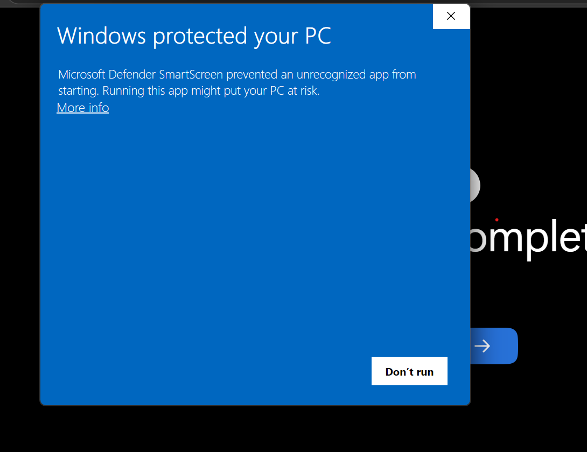
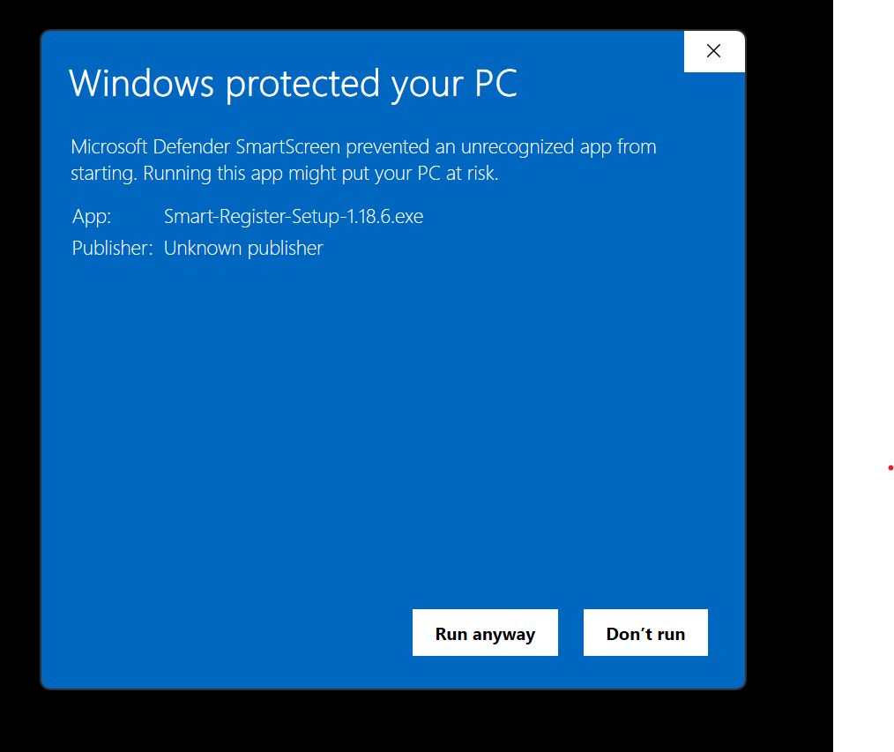

# Installing Smart Register on Windows

Smart Register is a Windows desktop app for the SJPI Class Register. Your
data stays on your laptop.

The installer is not yet signed. Windows shows an "unrecognised app"
warning the first time you run it. Click through it once. After that,
the app opens like any other program and updates itself in the
background.

## 1. Download

Open https://github.com/kkhinds/smart-register-releases/releases/latest

Under **Assets**, click `Smart-Register-Setup-1.x.x.exe` (the `1.x.x` is
the version, e.g. `1.17.9`). Ignore the `.blockmap` and `latest.yml`
files; the app uses those automatically once installed.

## 2. Run it

Double-click the file in your Downloads folder.

### "Windows protected your PC"

The first time you run the installer, Windows shows a blue warning. This
is because the app is not code-signed yet, not because anything is wrong
with it. You get past it in two clicks.

**Step 1. Click "More info".** The dialog first shows only a **Don't
run** button. Click the small underlined **More info** link near the top
left, just under the message.



**Step 2. Click "Run anyway".** The dialog now shows the app name and
"Unknown publisher", and a **Run anyway** button appears at the bottom
left. Click it.



The app should be named `Smart-Register-Setup-<version>.exe` and the
publisher will read "Unknown publisher". That is expected until the app
is signed, and it is safe to continue.

If the dialog has no **More info** link, the download was interrupted.
Re-download the installer.

### UAC prompt

> Do you want to allow this app to make changes to your device?

Click **Yes**.

## 3. Installer wizard

Click **Next** through every screen. The defaults are correct. On the
last screen click **Install**, wait a few seconds, then **Finish**.

## 4. Open the app

Press the **Windows key**, type `Smart Register`, press Enter.

To pin it to the Taskbar so it's one click away: right-click the
Smart Register icon in the Start Menu, then **Pin to taskbar**.

## Updates

Smart Register checks for updates on every launch and installs them
when you close the app. A "What's new" popup appears the first time
you open a new version.

The "Windows protected your PC" warning does not appear for updates.

## Where your data lives

Default location:

```
C:\Users\<your-username>\AppData\Roaming\sjpi-class-register\data\
```

To sync across machines via OneDrive or Google Drive: open the app,
**Settings** > **Storage location** > **Choose folder**, and pick a
folder inside your OneDrive or Google Drive directory.

## Troubleshooting

**Antivirus quarantined the file.** Some antivirus products block
unsigned installers. Either restore the file from quarantine and re-run
it, or add this folder to your antivirus exclusion list:
`C:\Program Files\Smart Register\`

**Installer crashes or hangs.** Right-click the installer, **Run as
administrator**. If it still fails, restart and try again. If still
broken, send your Windows version (Windows key, type `winver`,
screenshot the box that opens) and the error message to SJPI IT.

**Uninstall.** Windows key, type `Add or remove programs`, find
**Smart Register**, click **Uninstall**. Your data folder is not
deleted. Remove it manually if you want:
`C:\Users\<your-username>\AppData\Roaming\sjpi-class-register\`

**School laptop blocks the installer.** Some managed laptops block any
unsigned `.exe` even after **Run anyway**. Show this page to IT and
ask them to whitelist the installer or install it from an admin
account.

## Quick reference

| # | Action |
|---|--------|
| 1 | https://github.com/kkhinds/smart-register-releases/releases/latest |
| 2 | Download `Smart-Register-Setup-1.x.x.exe` |
| 3 | Double-click it |
| 4 | "Windows protected your PC" > **More info** > **Run anyway** |
| 5 | UAC > **Yes** |
| 6 | Wizard > **Next** > **Install** > **Finish** |
| 7 | Windows key > type `Smart Register` > Enter |
| 8 | Pin to Taskbar |
